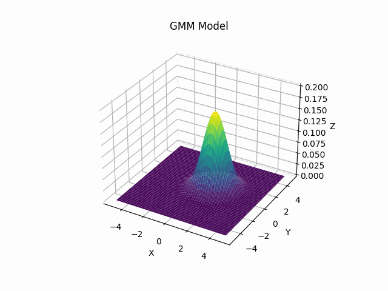

# PPO_with_MGMM
This project enhances the Proximal Policy Optimization (PPO) with Multivariate Gaussian Mixture Models (MGMMs).

This implementation is modified based on the ppo_continuous_action.py under the CleanRL framework. Please make sure to correctly install CleanRL (https://github.com/vwxyzjn/cleanrl), and ensure that ppo_continuous_action.py runs properly. Then, place our file in the same directory as ppo_continuous_action.py.

## Visualization of the learned MGMM policy during training on Swimmer-v4

